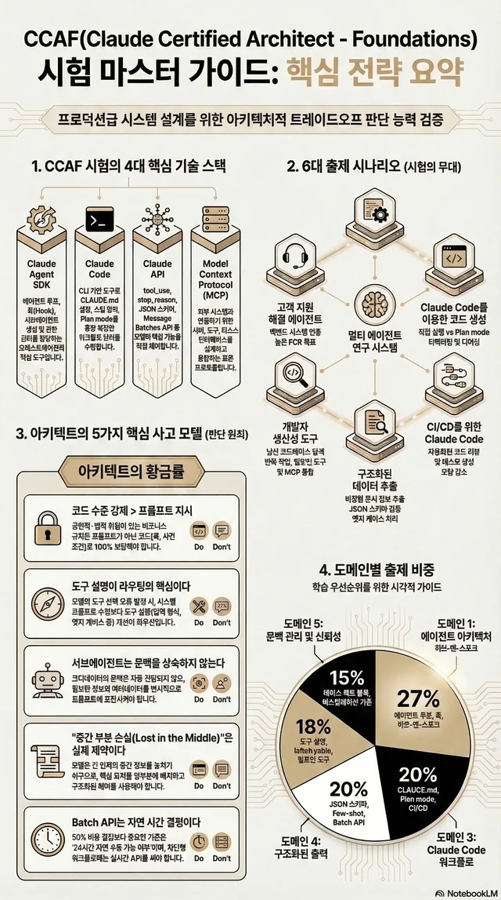
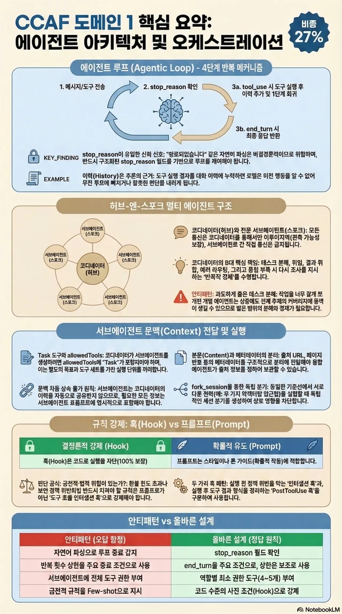
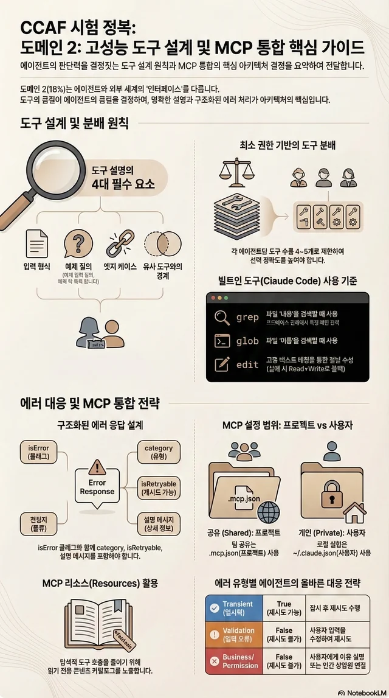
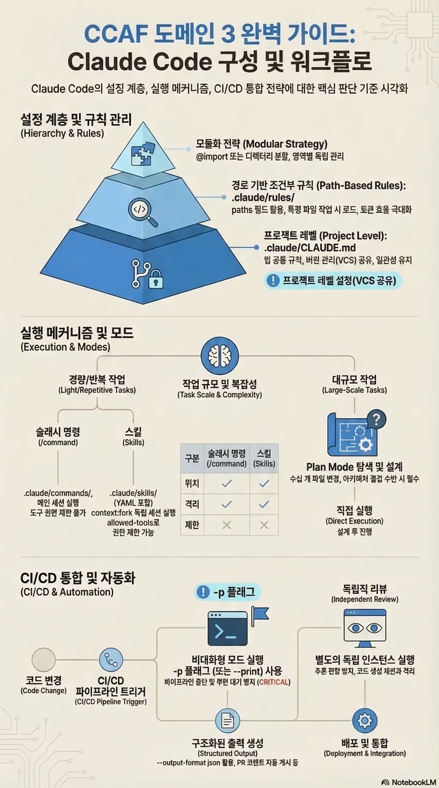
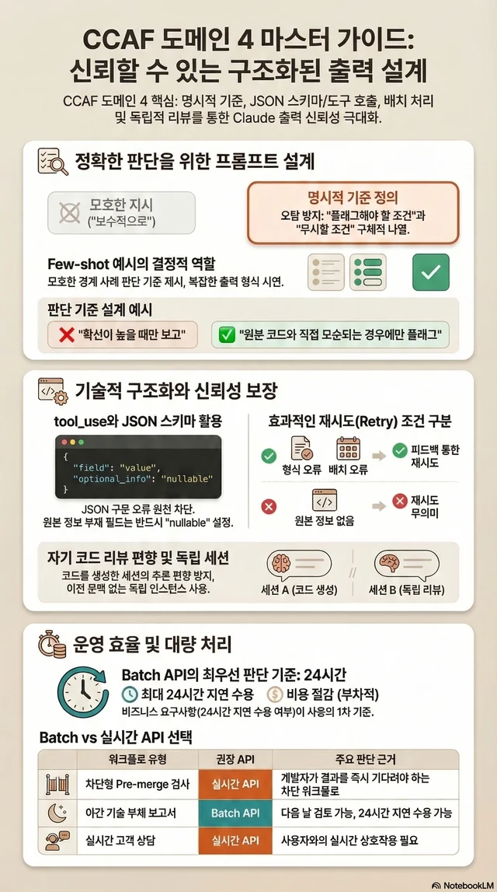
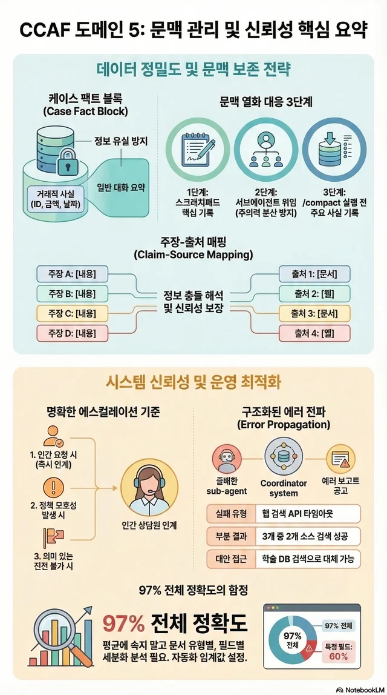

<section class="home-hero">
  
CCAF STUDY NOTES

  <h1>CCAF 101</h1>
  

    Claude Certified Architect - Foundations 시험을 준비하기 위한 한국어 학습 노트입니다.
  

  

CCAF Foundations의 출제 구조와 도메인별 판단 포인트를 빠르게 복습할 수 있도록 정리했습니다.
  

</section>

## 어디서 시작할지

  <a class="home-card" href="exam-overview/">
    <strong>시험 개요</strong>
    시험 구조, 시나리오, 도메인 비중, 준비 우선순위를 먼저 정리합니다.
  </a>
  <a class="home-card" href="domains/01-agent-architecture-and-orchestration/">
    <strong>D1. 에이전트 아키텍처</strong>
    가장 비중이 큰 영역입니다. 에이전트 루프, 멀티 에이전트 구조, 훅 설계부터 먼저 잡는 편이 좋습니다.
  </a>
  <a class="home-card" href="domains/03-claude-code-configuration-and-workflows/">
    <strong>D3. Claude Code 워크플로</strong>
    Claude Code 운영 방식, 규칙 파일 구조, plan mode, 팀 워크플로에서 자주 헷갈리는 포인트를 다룹니다.
  </a>

## 도메인별 문서

  <a class="home-card" href="domains/01-agent-architecture-and-orchestration/">
    <strong>D1. 에이전트 아키텍처</strong>
    27% · 에이전트 루프, 훅, 태스크 오케스트레이션, `fork_session`
  </a>
  <a class="home-card" href="domains/02-tool-design-and-mcp-integration/">
    <strong>D2. 도구 설계와 MCP</strong>
    18% · 도구 설명, MCP, 도구 선택, 에러 처리
  </a>
  <a class="home-card" href="domains/03-claude-code-configuration-and-workflows/">
    <strong>D3. Claude Code 워크플로</strong>
    20% · CLAUDE.md, rules, commands, plan mode, CI/CD
  </a>
  <a class="home-card" href="domains/04-prompt-engineering-and-structured-output/">
    <strong>D4. 구조화된 출력</strong>
    20% · 스키마 신뢰성, few-shot 예시, 검증 루프, batch 처리
  </a>
  <a class="home-card" href="domains/05-context-management-and-reliability/">
    <strong>D5. 문맥 관리와 신뢰성</strong>
    15% · 문맥 압축, 출처 매핑, 에스컬레이션, 스크래치패드
  </a>

## 인포그래픽 미리보기

인포그래픽은 빠른 복습을 위한 보조 요약 자료입니다. 일부 표현과 표기는 순차적으로 다듬고 있습니다. 카드를 누르면 원본 PNG가 새 탭에서 열립니다.

  <a class="home-thumb" href="assets/images/infographics/00-overview.png" target="_blank" rel="noopener">
    
    <strong>시험 개요</strong>
    전체 구조와 우선순위를 한 장으로 정리한 요약본
  </a>
  <a class="home-thumb" href="assets/images/infographics/01-agent-architecture.png" target="_blank" rel="noopener">
    
    <strong>D1. 에이전트 아키텍처</strong>
    루프, 훅, 태스크 오케스트레이션 핵심 요약
  </a>
  <a class="home-thumb" href="assets/images/infographics/02-tool-design-mcp.png" target="_blank" rel="noopener">
    
    <strong>D2. 도구 설계와 MCP</strong>
    도구 설명, MCP, 에러 처리 판단 기준 요약
  </a>
  <a class="home-thumb" href="assets/images/infographics/03-claude-code-workflows.png" target="_blank" rel="noopener">
    
    <strong>D3. Claude Code 워크플로</strong>
    CLAUDE.md, rules, commands, plan mode 복습용 요약
  </a>
  <a class="home-thumb" href="assets/images/infographics/04-structured-output.png" target="_blank" rel="noopener">
    
    <strong>D4. 구조화된 출력</strong>
    few-shot, schema, batch, 검증 루프 핵심 정리
  </a>
  <a class="home-thumb" href="assets/images/infographics/05-context-reliability.png" target="_blank" rel="noopener">
    
    <strong>D5. 문맥 관리와 신뢰성</strong>
    문맥 보존, 에스컬레이션, 출처 추적 요약
  </a>

## 추천 읽기 순서

1. [시험 개요](exam-overview.md)로 전체 시험 구조와 출제 시나리오를 먼저 잡습니다.
2. [D1](domains/01-agent-architecture-and-orchestration.md)과 [D3](domains/03-claude-code-configuration-and-workflows.md)부터 읽어 가장 높은 비중 구간을 선점합니다.
3. [D2](domains/02-tool-design-and-mcp-integration.md)를 이어서 읽고 도구 설계와 MCP 판단 기준을 붙입니다.
4. [D4](domains/04-prompt-engineering-and-structured-output.md)와 [D5](domains/05-context-management-and-reliability.md)를 묶어 출력 신뢰성과 장기 실행 안정성을 같이 복습합니다.

## Concept 허브를 같이 읽는 법

이 사이트는 각 도메인 본문만 읽어도 되지만, **개념 문서(concepts)**를 같이 보면 같은 주제가 다른 도메인에서 어떻게 다시 등장하는지 훨씬 잘 보인다.

추천 방식은 두 가지다.

1. **도메인 우선 읽기**
   - 먼저 Domain 본문을 읽고
   - 각 장의 `Concept Primer`에서 연결된 개념 문서를 따라간다.
   - 시험 직전에는 이 방식이 가장 빠르다.

2. **개념 축으로 가로질러 읽기**
   - 특정 판단 축을 중심으로 concepts를 연속해서 읽는다.
   - 예: `Agent Loop → Coordinator / Subagent → Session Management`
   - 예: `Tool Interface Design → Tool Selection & Disambiguation → Tool Safety Boundaries`
   - 예: `Structured Output as Contract → Schema Design for Reliability → Validation, Repair & Retry Loops`
   - 예: `Context Lifecycle Management → Source-grounded Context & Citation Fidelity → Reliability Patterns for Long-running Agents`

짧게 말하면:
> **도메인 문서는 시험 범위를 잡는 지도이고, concept 문서는 반복 출제되는 판단 축을 세우는 뼈대다.**

## 이 사이트를 보는 추천 감각

- **D1**은 전체 에이전트 구조를 잡는 뼈대
- **D2**는 도구를 모델이 어떻게 이해하고 선택하게 만들지에 대한 인터페이스 설계
- **D3**는 Claude Code를 운영 가능한 harness로 만드는 방법
- **D4**는 출력 신뢰성을 계약과 검증 루프로 다루는 방법
- **D5**는 장기 실행에서 문맥과 신뢰성을 유지하는 방법

즉 이 다섯 개를 따로 외우기보다,
> **아키텍처 → 도구 → 운영 워크플로 → 출력 계약 → 문맥 신뢰성**
흐름으로 보면 훨씬 덜 헷갈린다.

!!! note "참고"
    이 사이트의 내용은 AI를 활용해 번역하고 정리했습니다. 중요한 해석과 최종 판단은 공식 문서와 함께 다시 확인하는 것을 권장합니다.
